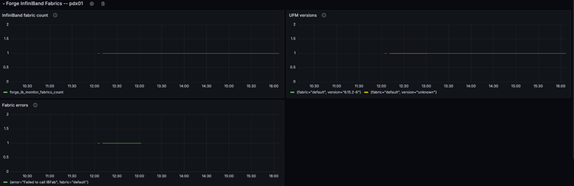

# Infiniband Runbook

## Motivation

[Infiniband](https://en.wikipedia.org/wiki/InfiniBand) This runbook describes the steps on infrastructure setup and configuration of enable Infiniband.

## Unified Fabric Manager (UFM)

### Installation

UFM 6.19.0 and up is recommended for configuring UFM in more security mode.

* Follow the [prerequisites](https://docs.nvidia.com/networking/display/ufmenterpriseqsglatest/installing+ufm+server+software) guidance to install all required packages, including the HA part.
* Follow the [HA installation](https://docs.nvidia.com/networking/display/ufmenterpriseqsglatest/installing+ufm+on+bare+metal+server+-+high+availability+mode) guidance to install the UFM in HA mode.

### Configuration

After UFM is deployed, the following security features must be enabled on UFM and OpenSM to enable secure Infiniband support in a multi-tenant site.

The management key (M_Key) is used across the subnet, and the administration key (SA_key) is for services.

Perform the following steps on the host that provides the NVIDIA Unified Fabric Manager (UFM) server.

#### Static configurations

Update the following parameters in `$UFM_HOME/ufm/files/conf/gv.cfg`.

```
…
default_membership = limited
…
randomize_sa_key = true
…
m_key_per_port = true
…
```

Update the following parameters in `$UFM_HOME/ufm/files/conf/opensm/opensm.conf`.

```
…
m_key_protection_level 2
…
cc_key_enable 2
…
n2n_key_enable 2
…
vs_key_enable 2
…
sa_enhanced_trust_model TRUE
…
sa_etm_max_num_mcgs 128
…
sa_etm_max_num_srvcs 32
…
sa_etm_max_num_event_subs 32
…
```

##### Static Topology configuration

Static network configuration can be applied to enhance security of Infiniband cluster.
It should be described in specific config file, named `topoconfig.conf`. The file is located at
```
$UFM_HOME/ufm/files/conf/opensm/topoconfig.conf
```
The file format is
```
0x98039b0300867bba,1,0xb83fd2030080302e,1,Any,Active
0x98039b0300867bba,3,0xb83fd2030080302e,3,Any,Active
0xb83fd2030080302e,1,0x98039b0300867bba,1,Any,Active
0xb83fd2030080302e,3,0x98039b0300867bba,3,Any,Active
0xb83fd2030080302e,26,0xf452140300280040,1,Any,Active
0xb83fd2030080302e,29,0xf452140300280080,1,Any,Active
0xb83fd2030080302e,30,0xf452140300280081,1,Any,Active
```
with fields description as
```
Source GUID, Source Port, Destination GUID, Destination Port, Device type, Link State
```
Starting UFM v6.19.0 to enable ability of UFM to work with static topology configuration `$UFM_HOME/ufm/files/conf/gv.cfg` file should include following parameter
```
…
[SubnetManager]
…
# This parameter defines if topoconfig file could be used for opensm discovery.
topoconfig_enabled = true
…
```
while on previous UFM versions this ability is enabled in file `$UFM_HOME/ufm/files/conf/opensm/opensm.conf` as
```
…
# The file holding the topo configuration.
topo_config_file $UFM_HOME/ufm/files/conf/opensm/topoconfig.conf

# If set to true, the SM will adjust its operational
# mode to consider the topo_config file.
topo_config_enabled TRUE
…
```

File `topoconfig.conf` can be created and modified manually or using UFM REST API starting v6.19.0.

For example initial `topoconfig.conf` file can be created as
```
curl -k -u admin:123456 -X POST https://<ufm host name>/ufmRest/static_topology/sm_topology_file | jq
{
"SM topoconfig action": "Create topoconfig file",
"job_id": "1"
}
```
Request job by its ID to check job completion.
```
curl -k -u admin:123456 -X GET https://<ufm host name>/ufmRest/jobs/1 | jq
{
    "ID": "1",
    "Status": "Completed",
    "Progress": 100,
    "Description": "Create opensm topoconfig file",
    "Created": "2024-10-27 08:09:16",
    "LastUpdated": "2024-10-27 08:09:17",
    "Summary": "/tmp/ibdiagnet_out/generated_topoconfig.conf",
    "RelatedObjects": "",
    "CreatedBy": "admin",
    "Operation": "opensm topoconfig file management",
    "Foreground": true,
    "SiteName": null
}
```
Once Job will be completed, path on UFM server to generated topoconfig file will be part of job completion message (Summary). Default generated topoconfig file location location: `/tmp/ibdiagnet_out/generated_topoconfig.conf`

#### Configurations per UFM

And the following configuration should be configured per UFM:

##### sm_key

A random 64bit integer is required for the sm_key, RANDOM environment value is a simple way to generate it as follows.

```
root:/# printf '0x%04x%04x%04x%04x\n' $RANDOM $RANDOM $RANDOM $RANDOM
0x771d2fe77f553d47
```

Update the sm_key in `$UFM_HOME/ufm/files/conf/opensm/opensm.conf` with the generated 64bit integer as follows.

```
…
sm_key 0x771d2fe77f553d47
…
```

##### allowed_sm_list

Get the GUID of openSM from `$UFM_HOME/ufm/files/conf/opensm/opensm.conf` of each UFM in the fabric.

```
…
guid 0x1070fd03001763d4
…
```

Update allowed_sm_guids in `$UFM_HOME/ufm/files/conf/opensm/opensm.conf` as follows.

```
…
allowed_sm_guids 0x1070fd03001763d4,0x966daefffe2ac8d2
…
```

##### User management

Update the password of the admin as follows. The default password of the admin is 123456; and the new password must be:

* Minimum length is 4
* Maximum length is 30, composed of alphanumeric and "_" characters

```
root:/# curl -s -k -XPUT -H "Content-Type: application/json" -u admin:123456 -d '{"password": "45364nnfgd"}' https://ufm.example.org:443/ufmRest/app/users/admin
{
  "name": "admin"
}
```

Generate a token for admin as follows:

```
root:/# curl -s -k -XPOST -u admin:x https://ufm.example.org:443/ufmRest/app/tokens | jq
{
  "access_token": "x",
  "revoked": false,
  "issued_at": 1711608244,
  "expires_in": 315360000,
  "username": "admin"
}
```

After the configuration, restart the UFM HA cluster as follows:

```
root:/# ufm_ha_cluster stop
root:/# ufm_ha_cluster start
```

And then check UFM HA cluster status:

```
root:/# ufm_ha_cluster status
```

## NICo

### Installation

No additional steps are required to enable Infiniband in NCX Infra Controller (NICo).

### Configuration

#### UFM Credential

One of two options can be selected to UFM Authentication mechanism such as `token authentication` or `client authentication`.
Follow the instructions in the section that applies to the selected option.

##### Token Authentication

Get the token of the admin user in UFM in above step, or get it again by following the rest api (the password of the admin user is required to get the token):

```
root:/# curl -s -k -XGET -u admin:password https://ufm:443/ufmRest/app/tokens | jq
[
  {
    "access_token": "token",
    "revoked": false,
    "issued_at": 1711609276,
    "expires_in": 315360000,
    "username": "admin"
  }
]
```

Create the credential for UFM client in NICo by carbide-admin-cli as follows:

```
root:/# carbide-admin-cli credential add-ufm --url=https://<address:port> --token=<access_token>
```

##### Client Authentication (mTLS)

Mutual TLS, or mTLS for short, is a method for mutual authentication. mTLS ensures that the parties at each end of a network connection are who they claim to be by verifying that they both have the correct private key. The information within their respective TLS certificates provides additional verification.
mTLS is often used in a Zero Trust security framework to verify users, devices, and servers within an organization.
Zero Trust means that no user, device, or network traffic is trusted by default, an approach that helps eliminate many security vulnerabilities.

###### Configure UFM to enable mTLS according the instruction

UFM Server Certificates should include UFM Host Name `<ufm host name>` into The Subject Alternative Name (SAN) extension to the X.509 specification.

Note:
- `<ufm host name>` should be as `default.ufm.forge`, `default.ufm.<site domain name>`. Where <site domain name> is taken from `initial_domain_name` NICo configuration parameter.
```
openssl x509 -in server.crt -text -noout | grep DNS
                DNS:default.ufm.forge, DNS:default.ufm.nico.example.org
```
- direct IP address is not supported.
- for UFM version less than 6.18.0-5 following patch should be applied as
```
--- /opt/ufm/scripts/ufm_conf_creator.py   2024-07-31 16:18:58.360497118 +0000
+++ /opt/ufm/scripts/ufm_conf_creator.py   2024-07-31 16:20:01.480677706 +0000
@@ -213,6 +213,7 @@
         self.fo.write('    SSLCertificateFile %s\n' % SERVER_CERT_FILE)
         self.fo.write('    SSLCertificateKeyFile %s\n' % SERVER_CERT_KEY_FILE)
         self.fo.write('    SSLCACertificateFile %s\n' % CA_CERT_FILE)
+        self.fo.write('    SSLVerifyClient require\n')
         self.fo.write('</VirtualHost>\n')

     def get_apache_conf_path(self):
```

**Select Client Authentication mode.**

Existing NICo certificates such as `/run/secrets/spiffe.io/{tls.crt,tls.key,ca.crt}` are used for client side.

    carbide-admin-cli credential add-ufm --url=<ufm host name>

**Generate UFM server certificate using Vault.**

Enter this command to create server UFM certificates using the vault:

    carbide-admin-cli credential generate-ufm-cert --fabric=default

UFM Server Certificates have predefined names as `default-ufm-ca-intermediate.crt, default-ufm-server.crt, default-ufm-server.key` and stored under `/var/run/secrets` location on `carbide-api` pod.

**Enter Docker UFM container.**
```
docker exec -it ufm /bin/bash
```

**Store server certificates at specific location.**

Create UFM Server certificates using certificates generated on previous step in the UFM specific location and with predefined file names.
```
/opt/ufm/files/conf/webclient/ca-intermediate.crt
/opt/ufm/files/conf/webclient/server.key
/opt/ufm/files/conf/webclient/server.crt
```

**Assign UFM Client Host Name with UFM `admin` role.**
It should be value from `client certificate SAN record` for example: carbide-api.forge.
```
/opt/ufm/scripts/manage_client_authentication.sh associate-user --san carbide-api.forge --username admin
curl -s -k -XGET -u admin:123456 https://<client host name>/ufmRest/app/client_authentication/settings | jq
{
  "enable": false,
  "client_cert_sans": [
    {
      "san": "<client host name>",
      "user": "admin"
    }
  ],
  "ssl_cert_hostnames": [],
  "ssl_cert_file": "Not present",
  "ca_intermediate_cert_file": "Not present",
  "cert_auto_refresh": {}
}
```

**Set UFM Server Host Name for certificate verification.**
It should be value from `server certificate SAN record` for example: default.ufm.forge.
```
/opt/ufm/scripts/manage_client_authentication.sh set-ssl-cert-hostname --hostname default.ufm.forge
curl -s -k -XGET -u admin:123456 https://<ufm host name>/ufmRest/app/client_authentication/settings | jq
{
  "enable": false,
  "client_cert_sans": [
    {
      "san": "<client host name>",
      "user": "admin"
    }
  ],
  "ssl_cert_hostnames": [
    "<server host name>"
  ],
  "ssl_cert_file": "Not present",
  "ca_intermediate_cert_file": "Not present",
  "cert_auto_refresh": {}
}
```

**Enable mTLS in UFM configuration file `/opt/ufm/files/conf/gv.cfg`.**
```
# Whether to authenticate web client by SSL client certificate or username/password.
client_cert_authentication = true
```

**Restart UFM.**
```
/etc/init.d/ufmd restart
```

**Check functionality.**
Existing carbide certificates such as `/run/secrets/spiffe.io/{tls.crt,tls.key,ca.crt}` are used for verification.
```
curl -v -s --cert-type PEM --cacert ca.crt --key tls.key --cert tls.crt -XGET  https://<ufm host name>/ufmRest/app/ufm_version | jq
*   Trying 192.168.121.78:443...
* TCP_NODELAY set
* Connected to carbide-api.forge (192.168.121.78) port 443 (#0)
* ALPN, offering h2
* ALPN, offering http/1.1
* successfully set certificate verify locations:
*   CAfile: ca.crt
  CApath: /etc/ssl/certs
} [5 bytes data]
* TLSv1.3 (OUT), TLS handshake, Client hello (1):
} [512 bytes data]
* TLSv1.3 (IN), TLS handshake, Server hello (2):
{ [112 bytes data]
* TLSv1.2 (IN), TLS handshake, Certificate (11):
{ [1232 bytes data]
* TLSv1.2 (IN), TLS handshake, Server key exchange (12):
{ [147 bytes data]
* TLSv1.2 (IN), TLS handshake, Server finished (14):
{ [4 bytes data]
* TLSv1.2 (OUT), TLS handshake, Client key exchange (16):
} [37 bytes data]
* TLSv1.2 (OUT), TLS change cipher, Change cipher spec (1):
} [1 bytes data]
* TLSv1.2 (OUT), TLS handshake, Finished (20):
} [16 bytes data]
* TLSv1.2 (IN), TLS handshake, Finished (20):
{ [16 bytes data]
* SSL connection using TLSv1.2 / ECDHE-ECDSA-AES256-GCM-SHA384
* ALPN, server accepted to use http/1.1
* Server certificate:
*  subject: [NONE]
*  start date: Jun 18 02:52:24 2024 GMT
*  expire date: Jul 18 02:52:54 2024 GMT
*  subjectAltName: host "carbide-api.forge" matched cert's "carbide-api.forge"
*  issuer: O=NVIDIA Corporation; CN=NVIDIA Forge Intermediate CA 2023 - pdx-qa2
*  SSL certificate verify ok.
} [5 bytes data]
> GET /ufmRest/app/ufm_version HTTP/1.1
> Host: carbide-api.forge
> User-Agent: curl/7.68.0
> Accept: */*
>
{ [5 bytes data]
* TLSv1.2 (IN), TLS handshake, Hello request (0):
{ [4 bytes data]
* TLSv1.2 (OUT), TLS handshake, Client hello (1):
} [252 bytes data]
* TLSv1.2 (IN), TLS handshake, Server hello (2):
{ [121 bytes data]
* TLSv1.2 (IN), TLS handshake, Certificate (11):
{ [1232 bytes data]
* TLSv1.2 (IN), TLS handshake, Server key exchange (12):
{ [147 bytes data]
* TLSv1.2 (IN), TLS handshake, Request CERT (13):
{ [159 bytes data]
* TLSv1.2 (IN), TLS handshake, Server finished (14):
{ [4 bytes data]
* TLSv1.2 (OUT), TLS handshake, Certificate (11):
} [1228 bytes data]
* TLSv1.2 (OUT), TLS handshake, Client key exchange (16):
} [37 bytes data]
* TLSv1.2 (OUT), TLS handshake, CERT verify (15):
} [111 bytes data]
* TLSv1.2 (OUT), TLS change cipher, Change cipher spec (1):
} [1 bytes data]
* TLSv1.2 (OUT), TLS handshake, Finished (20):
} [16 bytes data]
* TLSv1.2 (IN), TLS handshake, Finished (20):
{ [16 bytes data]
* old SSL session ID is stale, removing
{ [5 bytes data]
* Mark bundle as not supporting multiuse
< HTTP/1.1 200 OK
< Date: Tue, 02 Jul 2024 11:28:57 GMT
< Server: TwistedWeb/22.4.0
< Content-Type: application/json
< Content-Length: 34
< Rest-Version: 1.6.0
< X-Frame-Options: DENY
< X-Content-Type-Options: nosniff
< X-XSS-Protection: 1; mode=block
< Content-Security-Policy: script-src 'self'
< ClientCertAuthen: yes
<
{ [34 bytes data]
* Connection #0 to host carbide-api.forge left intact
{
  "ufm_release_version": "6.14.5-2"
}
```

#### carbide-api-site-config

Update the configmap `carbide-api-site-config-files` to configure
the UFM address/endpoint and the pkey range that is used per fabric as follows.

Infiniband typically expresses `Pkeys` in hex; the available range is `“0x0 ~ 0x7FFF”`.

```toml
[ib_fabrics.default]
endpoints = ["https://10.217.161.194:443/"]
pkeys = [{ start = "256", end = "2303" }]
```

Note that currently NICo only supports only a single IB fabric. Therefore only
the fabric ID `default` will be accepted here.

**NOTE**: A pkey will be generated for all partitions that are managed by NICo; ensure sure the range does not conflict with the existing pkey in UFM (if any).

Update the configmap `carbide-api-site-config-files` to enable Infiniband features as follows:

```toml
[ib_config]
enabled = true
```

To enable the monitor of IB, update the the configmap `carbide-api-site-config-files`  as follows:

```toml
[ib_fabric_monitor]
enabled = true
```

#### Restart carbide-api

Restart carbide-api to enable Infiniband in site-controller.

### Rollback

Update the configmap forge-system/carbide-api-site-config-files to disable Infiniband features as follows:

```toml
[ib_config]
enabled = false
```

Restart carbide-api to disable Infiniband in site-controller.

## FAQ

### Where’s the UFM home directory?

The default home directory is `/opt/ufm`.

### How to check UFM connection?

There is a debug tools for QA/SRE to check the address/token of UFM:

```
root@host-client:/$ kubectl apply -f https://bit.ly/debug-console
root@host-client:/$ kubectl exec -it debug-console -- /bin/bash
root@host-worker:/# export UFM_ADDRESS=https://<ufm address>
root@host-worker:/# export UFM_TOKEN=<ufm token>
root@host-worker:/# ufmctl list
IGNORING SERVER CERT, Please ensure that I am removed to actually validate TLS.
Name           Pkey      IPoIB     MTU       Rate      Level
api_pkey_0x5   0x5       true      2         2.5       0
api_pkey_0x6   0x6       true      2         2.5       0
management     0x7fff    true      2         2.5       0
```

The default partition (`management/0x7fff`) will include all available ports in the fabric; use the `view` sub-command to list all available ports as follows.

```
root@host-worker:/# ufmctl view --pkey 0x7fff
Name           : management
Pkey           : 0x7fff
IPoIB          : true
MTU            : 2
Rate Limit     : 2.5
Service Level  : 0
Ports          :
    GUID                ParentGUID          PortType  SystemID            LID       LogState  Name                SystemName
    1070fd0300bd494c    -                   pf        1070fd0300bd494c    3         Active    1070fd0300bd494c_1  localhost ibp202s0f0
    1070fd0300bd588d    -                   pf        1070fd0300bd588c    10        Active    1070fd0300bd588d_2  localhost ibp202s0f0
    1070fd0300bd494d    -                   pf        1070fd0300bd494c    9         Active    1070fd0300bd494d_2  localhost ibp202s0f0
    b83fd20300485b2e    -                   pf        b83fd20300485b2e    1         Active    b83fd20300485b2e_1  PDX01-M01-H19-UFM-storage-01
    1070fd0300bd5cec    -                   pf        1070fd0300bd5cec    5         Active    1070fd0300bd5cec_1  localhost ibp202s0f0
    1070fd0300bd5ced    -                   pf        1070fd0300bd5cec    8         Active    1070fd0300bd5ced_2  localhost ibp202s0f0
    1070fd0300bd588c    -                   pf        1070fd0300bd588c    7         Active    1070fd0300bd588c_1  localhost ibp202s0f0
```

### How to check the auth token and UFM IP in NICo?

After configuring UFM credentials in NICo, using the following commands to check whether the token was updated in Vault accordingly.

```
kubectl exec -it vault-0 -n vault -- /bin/sh
vault kv get -field=UsernamePassword --tls-skip-verify secrets/ufm/default/auth
```

This returns something like
```
======== Secret Path ========
secrets/data/ufm/default/auth

======= Metadata =======
Key                Value
---                -----
created_time       2024-10-17T15:08:13.312903569Z
custom_metadata    <nil>
deletion_time      n/a
destroyed          false
version            2

========== Data ==========
Key                 Value
---                 -----
UsernamePassword    map[password:ABCDEF username:https://1.2.3.4:443/]
```

The `username` here encodes the UFM address, while the `password` identifies the auth token.

SRE can also check the InfiniBand fabric monitor metrics emitted by NICo to determine whether it can reach UFM. E.g. the following graph shows a scenario where

* First NICo could not connect to UFM to invalid credentials
* Fixing the credentials provided access and lead UFM metrics (version number) to be emitted



### How to check the log of UFM?

Check the log of rest api:

```
root:/# tail $UFM_HOME/files/log/rest_api.log
2024-03-28 07:42:02.954 rest_api INFO    user: ufmsystem, url: (http://127.0.0.1:8000/app/ufm_version/), method: (GET)
2024-03-28 07:42:22.955 rest_api INFO    user: ufmsystem, url: (http://127.0.0.1:8000/app/ufm_version/), method: (GET)
2024-03-28 07:42:42.957 rest_api INFO    user: ufmsystem, url: (http://127.0.0.1:8000/app/ufm_version/), method: (GET)
2024-03-28 07:43:02.960 rest_api INFO    user: ufmsystem, url: (http://127.0.0.1:8000/app/ufm_version/), method: (GET)
2024-03-28 07:43:22.959 rest_api INFO    user: ufmsystem, url: (http://127.0.0.1:8000/app/ufm_version/), method: (GET)
2024-03-28 07:43:42.963 rest_api INFO    user: ufmsystem, url: (http://127.0.0.1:8000/app/ufm_version/), method: (GET)
2024-03-28 07:44:02.960 rest_api INFO    user: ufmsystem, url: (http://127.0.0.1:8000/app/ufm_version/), method: (GET)
2024-03-28 07:44:22.963 rest_api INFO    user: ufmsystem, url: (http://127.0.0.1:8000/app/ufm_version/), method: (GET)
2024-03-28 07:44:42.964 rest_api INFO    user: ufmsystem, url: (http://127.0.0.1:8000/app/ufm_version/), method: (GET)
2024-03-28 07:45:02.964 rest_api INFO    user: ufmsystem, url: (http://127.0.0.1:8000/app/ufm_version/), method: (GET)
```

Check the log of UFM:

```
root:/# tail $UFM_HOME/files/log/ufm.log
2024-03-28 07:46:17.742 ufm   INIT    Request Polling Delta Fabric
2024-03-28 07:46:17.746 ufm   INIT    Get Polling Delta Fabric
2024-03-28 07:46:29.189 ufm   INIT    Prometheus Client: Start request for session 0
2024-03-28 07:46:29.190 ufm   INIT    Prometheus Client: Total Processing time = 0.001149
2024-03-28 07:46:29.191 ufm   INIT    handled device stats. (6) 28597.53 devices/sec. (10) 47662.55 ports/sec.
2024-03-28 07:46:47.748 ufm   INIT    Request Polling Delta Fabric
2024-03-28 07:46:47.751 ufm   INIT    Get Polling Delta Fabric
2024-03-28 07:46:59.190 ufm   INIT    Prometheus Client: Start request for session 0
2024-03-28 07:46:59.191 ufm   INIT    Prometheus Client: Total Processing time = 0.001762
2024-03-28 07:46:59.192 ufm   INIT    handled device stats. (6) 25497.29 devices/sec. (10) 42495.48 ports/sec.
```

### How to update pool.pkey?

Did not support updating pool.pkey after configuration.

## Reference

* [NVIDIA UFM Enterprise Quick Start Guide](https://docs.nvidia.com/networking/display/ufmenterpriseqsglatest)
* [NVIDIA UFM Enterprise REST API](https://docs.nvidia.com/networking/display/ufmenterpriserestapilatest)
